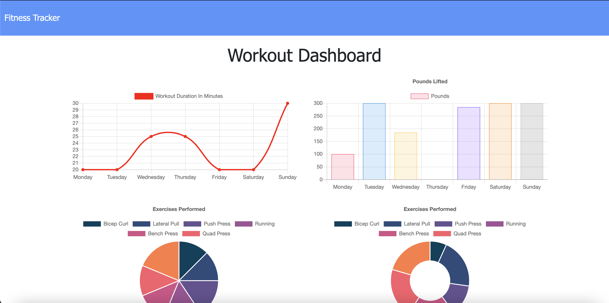
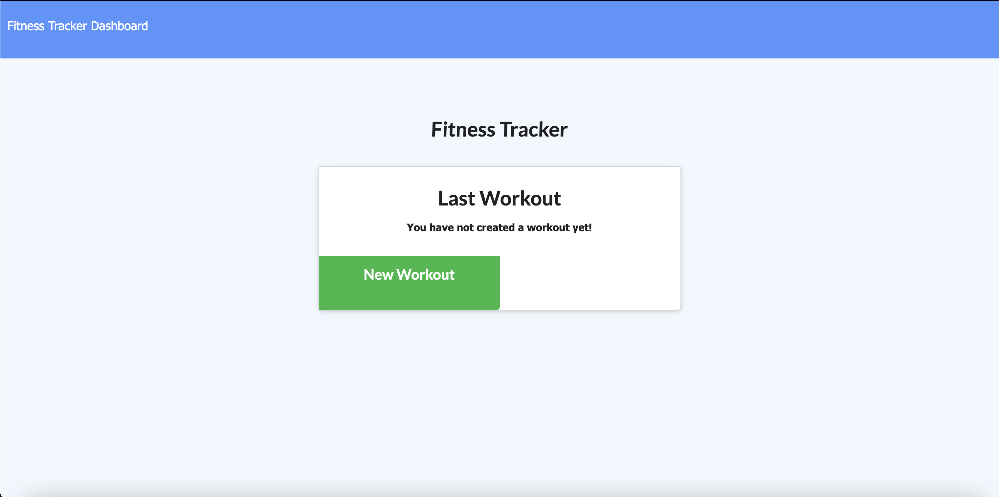

# NoSQL Homework: Workout Tracker


## Description

For this assignment, you'll create a workout tracker. You have already been provided with the front end code in the Develop folder. This assignment will require you to create Mongo database with a Mongoose schema and handle routes with Express.

### Table of Contents

* [Local Installation](#local-installation)

* [Usage](#usage)

* [License](#license)

* [Questions](#questions)

## Local Installation

Install node packages

```bash
npm i
```

Start application

```bash
npm start
```

To seed database

```bash
npm run seed
```

Seed Data



## Usage

Application deployed to Heroku.

[Fitness Tracker](https://glacial-mountain-32580.herokuapp.com/)



## License

This project is licensed under the MIT License.
Click [Link](https://choosealicense.com/licenses/mit/) for more information.

## Questions

Juan Sanchez

[Github Profile](https://github.com/karizmatik215)

juan.sanchez@phila.gov
